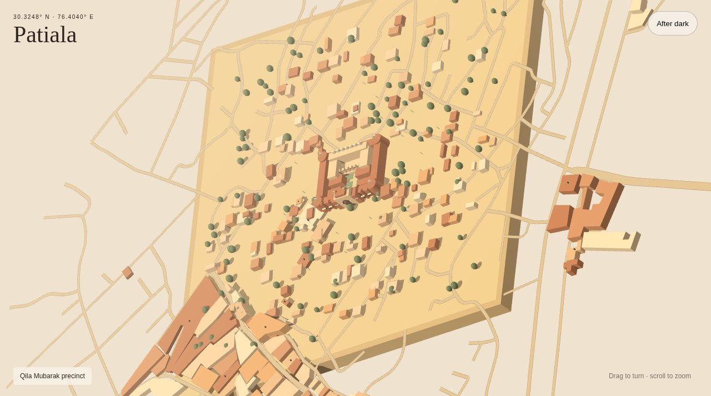

# Tiny Patiala

A soft isometric miniature of Patiala's old city core around Qila Mubarak.



**Live:** https://aeiouvcode.github.io/tiny-patiala/

## About

A tiny model of the streets around Qila Mubarak at 30.3248° N, 76.4040° E. Drag to turn, scroll to zoom, switch to after dark, and look for the kite.

## Run locally

```sh
git clone https://github.com/aeiouvcode/tiny-patiala.git
cd tiny-patiala
python3 -m http.server 8000
```

Then open http://localhost:8000.

## Layout

```
index.html   page shell
app.js       built scene bundle (npm run build from src/)
src/         scene source and street data
docs/        README assets
```
